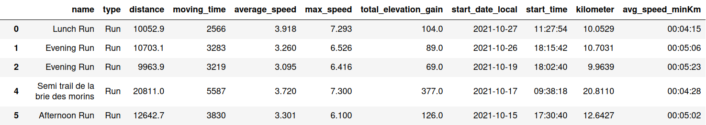
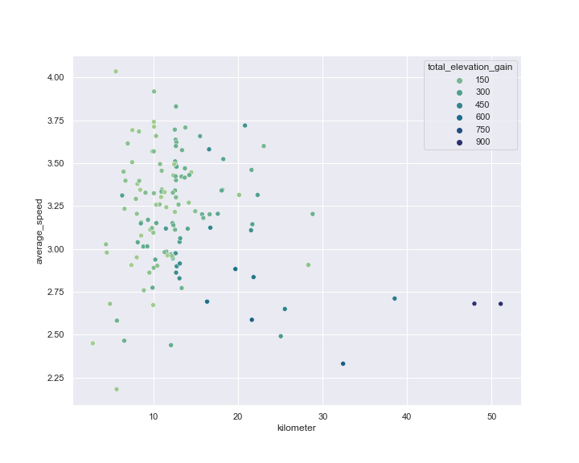
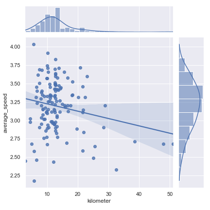
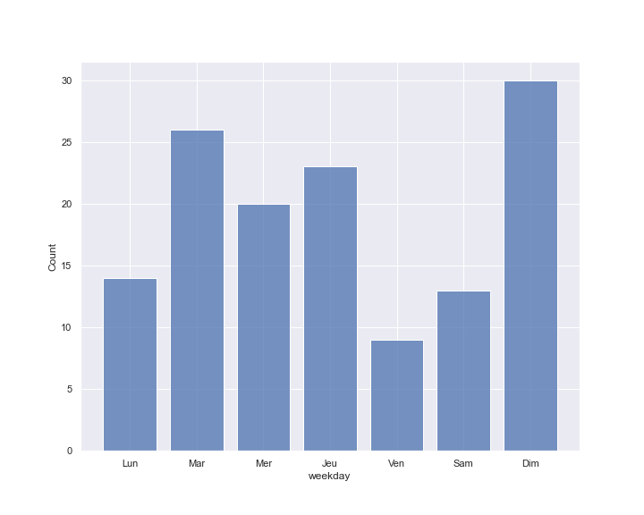

## Introduction
There are two things I really like, running and data science. That's why I said to myself why not do a project combining these two fields. I have recorded all my runs on Strava, a sports ride sharing application, so I 'll be able to study my own data.

## Get the data
I was able to get all my data by following this [Tutorial]. 
In short you just need to get your access token from your Strava account and then you can request your data via the [Strava API]
I also used this [code] to get my data as a pandas DataFrame.

[Tutorial]: https://towardsdatascience.com/using-the-strava-api-and-pandas-to-explore-your-activity-data-d94901d9bfde
[Strava API]: https://developers.strava.com/docs/getting-started/
[code]: https://github.com/fpolignano/Code_From_Tutorials/blob/master/Strava_Api/strava_api.py

## Data Exploration
My Data Set contains 145 outputs and for each of these outputs there are 55 features. In order to focus on the information I am interested in, I decide to keep about ten columns. 

  

In this plot each point is a run with the distance on the x axis and the average speed on the y axis. The color of the point represent the total elevation gain suring the run. We can see a small correlation between the length of the run and the elevation gain but also, obviously, that the shorter the run is the faster it is.

  

In this one, we have also access to the distribution of the average speed and the distance. The regression line that is plottet also tell uss that it's not a good model.

  

This histogram show the number of runs for each day of the week. It's really simple but I found it cool because we can't have those Data on the Strava applications.

  

